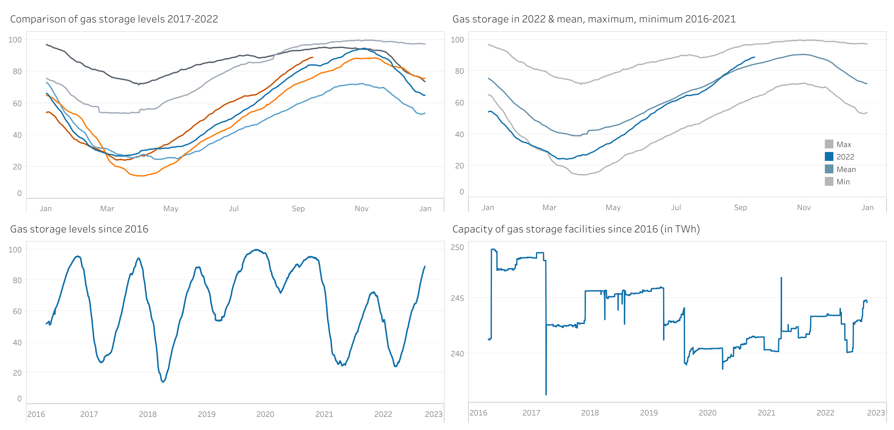

# Level of German gas storage facilities
By Deniz Firat  
September, 2022

# Introduction
As Germany is approaching winter and people are worried about the gas storage facilities due to the current situation, I have evaluated and visualized the data of the gas storage levels since 2013 so that one can quickly get an up-to-date picture of the situation.

# Process
For data cleaning and analysis, I used RStudio, an integrated development environment for R. The exact procedure can be viewed [here](https://github.com/dfirat/germany-gas-storage/blob/main/germany-gas-storage.md).
I used Tableau to visualize the results, which can be viewed [here](https://public.tableau.com/app/profile/dfirat/viz/LevelofGermangasstoragefacilities/Dashboard1).

# Results
Although gas supplies from Russia to Germany have declined significantly, gas storage facilities are currently filling up noticeably. It should also be emphasized that they are being filled even faster than the 2013-2021 average.

